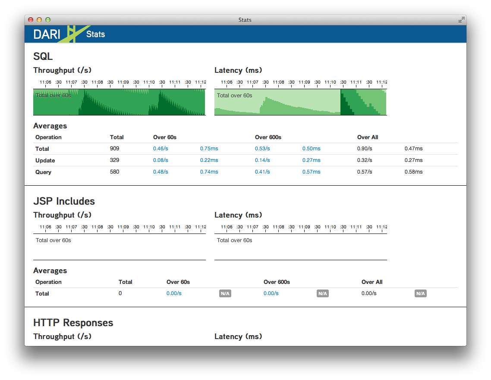

## Advanced

### Transactions

Transactions require obtaining an instance of the `Database` object you
want to run a transation on. Generally you want to use the default
database. Transactions are thread bound.


Database db = Database.Static.getDefault();
db.beginWrites();
try {
    // Save Dari objects using save().
    ...
    db.commitWrites();
} finally {
    db.endWrites();
}

Every call to `beginWrites()` must be followed by a call to
`endWrites()`.

### Background Tasks

Dari provides a easy to use task system for creating and monitoring background 
tasks. To create a new task, subclass `com.psddev.dari.util.Task` and
implement [doTask()](javadocs/com/psddev/dari/util/Task.html#doTask%28%29) method on the object.
Since tasks typically loop over data and process it, it
is best practice to call
[shouldContinue()](javadocs/com/psddev/dari/util/Task.html#shouldContinue%28%29)
on each iteration of the
loop to determine if the task has been stopped or paused by the Task
Manager interface.

Alternatively you can create an anonymous class
implementation of Task:


Task task = new Task("Migration", "Migration Blog Data") {
    @Override
    public void doTask() throws Exception {
        boolean done = false;
        while(!done && shouldContinue()) {
            // Do processing here
        }
    }
}

task.start(); 

This task will show up under the **Migration** group of the Task Manager
interface and will be called **Migration Blog Data**. The Task Manager displays
all running tasks on the server and provides methods for starting and stopping
them.

See the [Configuration](configuration.html#debug-tools) section of the documentation for information on
how to configure the debug tools.

### Server Status

Dari provides an server status tool which provides insight into
how many queries are being performed their latency. It will also provide
information about which JSPs are slow. The server status tool can be
found at `/_debug/stats`.

See the [Configuration](configuration.html#debug-tools) section of the documentation for information on
how to configure the debug tools.

