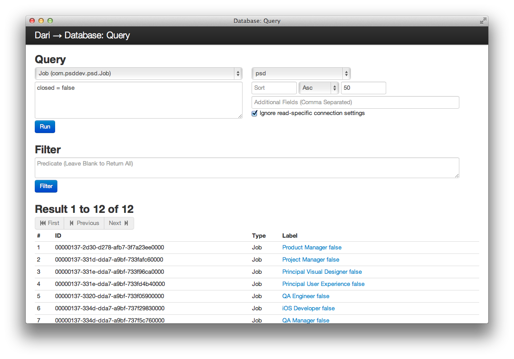

## Querying

Dari provides a database-abstraction API that lets you retrieve your data
models. Queries are represented by instances of the [Query](javadocs/index.html?com/psddev/dari/db/Query.html) class. This
class should look very familiar to anybody that has used SQL before.

If you have Dari already installed, you can use the Code Tool to test out these
queries.

This documentation provides an overview of the most common methods used
to query objects in Dari. For a complete list of available methods see the
[Query](javadocs/index.html?com/psddev/dari/db/Query.html) JavaDocs.

### The **FROM** clause

The simplest Dari query is to select all records of a given type:


List<Author> authors = Query.from(Author.class).selectAll();


This will return all instances of the `Author` class.

Inheritance also works with the `FROM` clause by querying from a base
class. It is possible to build an activity feed, for example:


public class Activity extends Record {
    @Index private Date activityDate;
    @Index private User user;
}
public class Checkin extends Activity { ... }
public class Comment extends Activity { ... }
public class ReadArticle extends Activity { ... }
public class PostedArticle extends Activity { ... }


Given this class heirarchy we can query for user's activity by querying
from the `Activity` class. This will implicitly also retrieve any
records that are subclasses of `Activity`.


PaginatedResults<Activity> results = Query.from(Activity.class).
        where("user = ?", user).
        sortDescending("activityDate").select(0, 10);


### The **LIMIT** clause

Dari supports limiting the number of results returned using the
[select(long offset, int limit)](javadocs/com/psddev/dari/db/Query.html#select%28long,%20int%29) or
[first()](javadocs/com/psddev/dari/db/Query.html#first%28%29) methods.


PaginatedResults<Article> articles = Query.from(Article.class).
                                        sortAscending("title").select(0, 10);
List<Article> items = articles.getItems();


This will start at offset 0 and return the next 10 instances of `Article`. The
result of a limit query is a
[PaginatedResult](javadocs/index.html?com/psddev/dari/util/PaginatedResult.html). This class
provides methods for working with paginated results as
[hasNext()](javadocs/com/psddev/dari/util/PaginatedResult.html#hasNext%28%29) and
[getNextOffset()](javadocs/com/psddev/dari/util/PaginatedResult.html#getNextOffset%28%29) for building
pagination. To get all items in a PaginatedResult use
[getItems()](javadocs/com/psddev/dari/util/PaginatedResult.html#getItems%28%29).

### The **WHERE** clause

The `WHERE` method allows you to filter which object instances that are returned.
In order to filter by a field it must have the @Index annotation.


Author author = Query.from(Author.class).where("name = 'John Smith'").first();


This will return the first instance of `Author` with the name 'John Smith'.

Logical operations `not, or, and` are supported.


List<Author> authors = Query.from(Author.class).
                        where("name = 'John Smith' or name = 'Jane Doe'").selectAll();


The `Query` class follows the builder pattern so this query can also be written as:


List<Author> authors = Query.from(Author.class).
                        where("name = 'John Smith'").
                        and("name = 'Jane Doe'").selectAll();


For a list of all supported predicates see the [Predicate](predicate.html) documentation.

### Querying Relationships

Dari supports querying relationships using path notation (i.e. field/subfield)
in `WHERE` clauses. A common use case is finding all articles by a particular
author. We'll use the following models to demonstrate how to use path notation.


public class Article extends Record {
    @Index private Author author;
    private String title;
    private String body;

    // Getters and Setters...
}

public class Author extends Record {
    private String firstName;
    @Index private String lastName;
    @Index private String email;

    // Getters and Setters...
}

There are two ways we can find articles by a specific author. We can
query for the author first and then query for articles by that
author.


Author author = Query.from(Author.class).where("email = 'john.smith@psddev.com'");
List<Articles> = Query.from(Articles.class).where("author = ?", author);


However, it's easier and more efficient to do this in a single query
using path notation.


List<Articles> = Query.from(Articles.class).where("author/email = 'john.smith@psddev.com'");


### Bind variables

In the previous section we used `?` in our `WHERE` clause when specifying the author. Dari supports bind
variables in query strings using `?` for placeholders.


String authorName = "John Smith";
Author author = Query.from(Author.class).
                where("name = ?", authorName).first();


Placeholders can be basic types like `String` or `Integer` but they can also be
Lists or other Dari objects. This allows for `IN` style queries.


List<String> names = new ArrayList<String>();
names.add("John Smith");
names.add("Jane Doe");
List<Author> authors = Query.from(Author.class).
                        where("name = ?", names).selectAll();


### The **ORDER BY** clause

Results can be ordered using [sortAscending(String field)](javadocs/com/psddev/dari/db/Query.html#sortAscending%28java.lang.String%29) and
[sortDescending(String field)](javadocs/com/psddev/dari/db/Query.html#sortDescending%28java.lang.String%29) methods.  Both of these methods take the name of
the field to sort. The field being sorted must have the `@Indexed`
annotation.


List<Author> authors = Query.from(Author.class).sortAscending("name");


### The **GROUP BY** clause

Using the [groupBy(String... fields)](javadocs/com/psddev/dari/db/Query.html#groupBy%28java.lang.String...%29) method allows queries to return items in
groupings, based on associations.  In the example below we will return a count
of articles grouped by the tags associated with each.

To show how group works we'll use the following example Article that
contains the Tag field that we will group by.


public class Article extends Record {
    private Tag tag;
    private String author;

    // Getters and Setters
}


Now the groupBy query:


List<Grouping<Article>> groupings = Query.from(Article.class).groupBy("tag")

for (Grouping grouping : groupings) {
    Tag tag = (Tag) grouping.getKeys().get(0);
    long count = grouping.getCount();
}


It is possible to retrieve the items that make up a grouping by using
the [createItemsQuery()](javadocs/com/psddev/dari/db/Grouping.html#createItemsQuery%28%29) method on the returned `Grouping` objects. This
method will return a `Query` object.


List<Grouping<Article>> groupings = Query.from(Article.class).groupBy("tag")

for (Grouping grouping : groupings) {
    Tag tag = (Tag) grouping.getKeys().get(0);
    List<Article> articles = grouping.createItemsQuery().selectAll();
}


Grouping by more than one item, for example, a Tag, and Author is
possible as well.


List<Grouping<Article>> groupings = Query.from(Article.class).groupBy("tag" , "author") 

for (Grouping grouping : groupings) {
    Tag tag = (Tag) grouping.getKeys().get(0);
    Author author = (Author) grouping.getKeys().get(1);
    long count = grouping.getCount();
}


To sort the count, add standard sorters;


List<Grouping<Article>> groupings = Query.from(Article.class).sortAscending("tag").groupBy("tag")

for (Grouping grouping : groupings) {
    Tag tag = (Tag) grouping.getKeys().get(0);
    List<Article> articles = grouping.createItemsQuery().getSorters().clear().SelectAll();
}


### Query Tool

When used in a J2EE web project Dari provides a query tool that supports the Dari query
syntax. This tool can be found at `/_debug/query`.

See the [Configuration](configuration.html#debug-tools) section of the documentation for information on
how to configure the debug tools.

### Spatial Queries

Dari supports spatial queries on MySQL, PostgreSQL and Solr. To use Dari's
spatial features define a field of type
`com.psddev.dari.db.Location` on the model you want to do spatial lookups on.
This type is a container for latitude and longitude values. This field should be
annotated with the `@Index` annotation.

For example:


public class Venue {
    private String name;
    @Index private Location location;

    // Getters and Setters
}


To find all venues within a 10 mile radius of Reston Town Center in
Reston, VA we would issue the following query:


PaginatedResult<Venue> venues = Query.from(Venue.class).
        where("location = ?", Region.sphericalCircle(38.95854, -77.35815, 10));


Sorting venues by closest works as well:


PaginatedResult<Venue> venues = Query.from(Venue.class).
        where("location = ?", Region.sphericalCircle(38.95854, -77.35815, 10)).
        sortClosest("location", new Location(38.95854, -77.35815));


    <strong>Performance Tip:</strong>
    
When using <code>sortClosest</code> you should limit the results to be inside
    a given distance with a <code>WHERE</code> clause. This will speed up your query.
    

