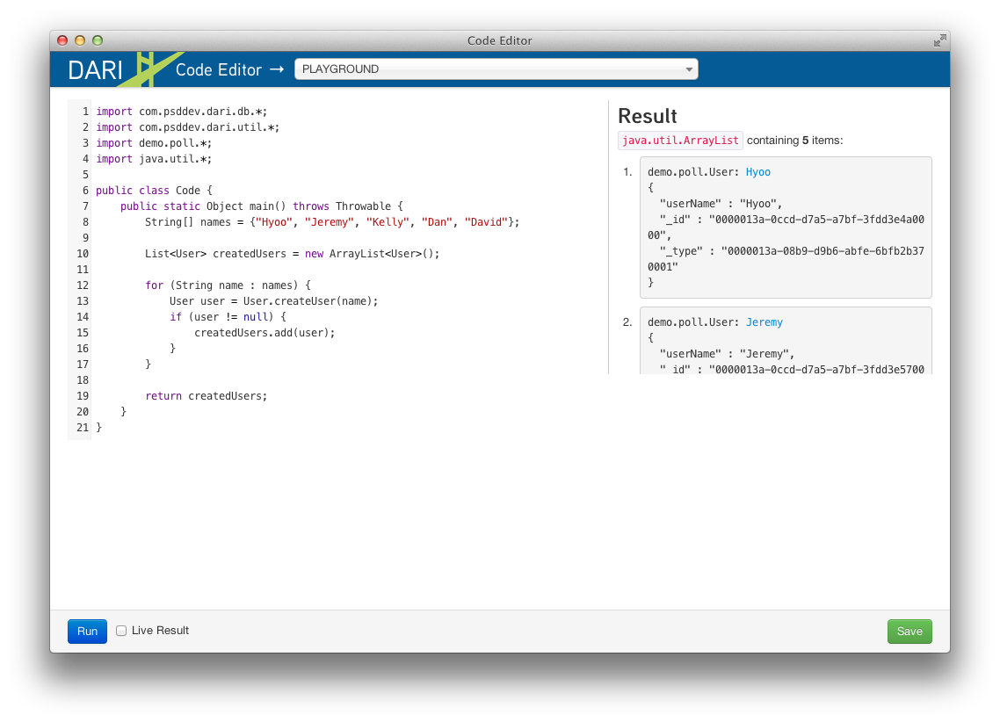
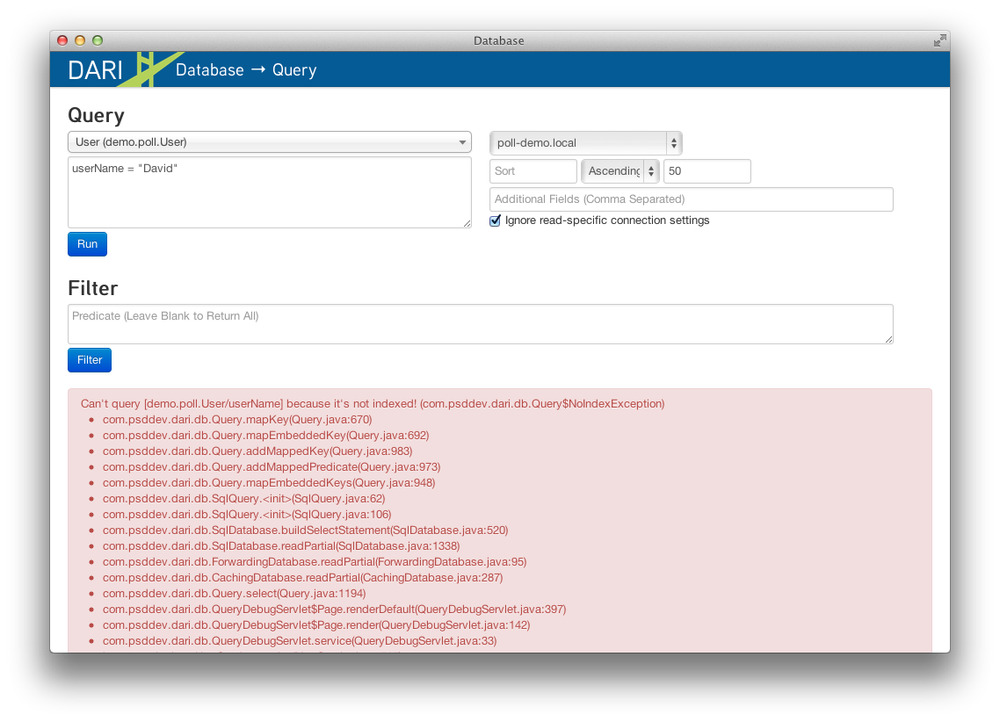
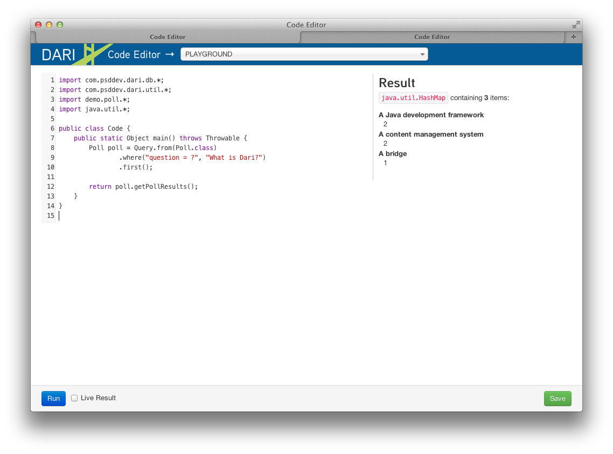

## Introduction

We believe that working with data, whether they're simple blog posts or
something much more complex, is the most critical part of building any
application. It's also the most difficult and frustrating, because the
current generation of data access frameworks don't do enough to provide
you with all the information necessary to let you be productive as possible.

Dari was created at [PERFECT SENSE digital](http://www.perfectsensedigital.com/)
to make our work in handling data for a variety of clients in different
industries easier and more efficient. We wanted to create a comprehensive
toolset that spans every aspect of how data flows throughout your application.

This is the fruit of our work so far, and we wanted to share it with the
world. We hope you enjoy working with it as much as we do.

### Getting Started

Dari provides a Maven archetype to help you quickly set up a new web
application. Replace the value for `groupId` with your company name, and the
value for `artifactId` with your project's name. *Note, your `artifactId` should not contain spaces.* 

After running the following
command in a terminal, you'll have a project directory named after the
`artifactId` you provided.

    mvn archetype:generate -B \
        -DarchetypeRepository=http://public.psddev.com/maven \
        -DarchetypeGroupId=com.psddev \
        -DarchetypeArtifactId=dari-app-archetype \
        -DarchetypeVersion=2.0-SNAPSHOT \
        -DgroupId=com.yourcompany \
        -DartifactId=yourproject

You can run the application using [Apache Tomcat](http://tomcat.apache.org)
through the [Cargo Maven plugin](http://cargo.codehaus.org/Maven2+plugin):

    mvn package cargo:run

After the web server starts up, you'll see the default welcome page when you
visit [http://localhost:8080/](http://localhost:8080/).

The directory generated by the archetype is a standard Maven web project:

    pom.xml
    src/main/resources/settings.properties
    src/main/webapp/WEB-INF/web.xml

Dari reads all its configuration information from the `settings.properties`
file, and it's pre-configured to use the [H2 database engine](http://www.h2database.com/html/main.html)
as its default database.

### Tutorial

As part of the Dari distribution you are provided with a suite of debugging
tools that will aide you in the development process. They can all be accessed
from your browser at **http://localhost:8080/_debug/** and individually by
appending the tool name to the end of the URL. A few key ones referenced in
this tutorial are outlined below. To get back to the debugging tools landing
page, click the Dari logo in the top left corner of page.

code
: Execute arbitrary blocks of code, create new Java files, and edit existing
Java and JSP files.

db-bulk
: Run bulk operations such as copying one database to another and index
existing databases.

db-schema
: A visualization of the object model.

query
: Database agnostic query interface, coupled with an object data editor.

task
: Background task monitoring with controls to stop, start, and pause taks.

#### Writing Your First Dari Application

Now let's build a simple Polls application. At the end of this tutorial you 
should have a basic understanding of how to model and query data using Dari,
as well as some of the web-based tools available that make it easy to work with
Dari.

We're going to model a simple Poll application that allows users to take a poll
and view the polls results.

Dari differs from a traditional ORM in that it does not map Java classes to
individual database tables. Instead it stores data in a schema-less format that
is appropriate for the underlying database. For RDBMS this format is a JSON
blob. Storing data as a JSON blob frees Dari from needing to manage schema
evolution which allows for rapid data model changes. This is a very powerful
feature.

Let's start off by creating a few simple Java classes that we will need for our
Polls application.

    <strong>TIP:</strong>
    
You can create new Java classes directly from your browser by using the
    <strong>code</strong> debug tool, selecting <strong>NEW CLASS</strong> from
    the dropdown in the header, pasting the code into the editor and clicking
    Save.


package demo.poll;

import com.psddev.dari.db.*;
import com.psddev.dari.util.*;
import java.util.*;

public class Answer extends Record {
    private String answer;

    public String getAnswer() {
        return answer;
    }
    public void setAnswer(String answer) {
        this.answer = answer;
    }
}

---

package demo.poll;

import com.psddev.dari.db.*;
import com.psddev.dari.util.*;
import java.util.*;

public class Poll extends Record {
    private String question;
    private List<Answer> answers;
    
    public String getQuestion() {
        return question;
    }
    public void setQuestion(String question) {
        this.question = question;
    }
    public List<Answer> getAnswers() {
        return answers;
    }
    public void setAnswers(List<Answer> answers) {
        this.answers = answers;
    }
}

---

package demo.poll;

import com.psddev.dari.db.*;
import com.psddev.dari.util.*;
import java.util.*;

public class User extends Record {
    private String userName;
    private String firstName;
    private String lastName;
    
    public String getUserName() {
        return userName;
    }
    public void setUserName(String userName) {
        this.userName = userName;
    }
}


All Dari objects must extend `com.psddev.dari.db.Record`. This is all that is
needed to start persisting object data. Lets see the visual representation of
it using the **db-schema** debug tool. Once there select `demo.poll.Poll` and
`demo.poll.User` from the dropdown and click View.  This is exactly what we
expect so lets move on.

As part of our Poll application we need the ability to create new users as well
as fetch existing ones.  Let's add a some static methods to the User class to
do just that.

    <strong>TIP:</strong>
    
You can also edit existing Java classes directly from your browser by
    using the <strong>code</strong> debug tool. Select the class you want to
    edit from the dropdown, make changes, and click Save.


public class User extends Record {
    // ... fields, getters, setters...

    public static User createUser(String userName) {
        if (userName == null || "".equals(userName = userName.trim())) {
            return null;
        } else {
            User user = new User();
            user.setUserName(userName);
            user.save();
            return user;
        }
    }

    public static User getUser(String userName) {
        return Query.from(User.class)
                .where("userName = ?", userName)
                .first();
    }
}


Here we introduce the `save()` API which is inherited from `Record` and the
`com.psddev.dari.db.Query` API.  Calling `save()` on an instantiated object
is all that it takes to persist objects in Dari.  Similarly, the `Query` API
provides all the necessary methods to retrieve persisted objects.  The `Query`
syntax is based on
<a href="http://msdn.microsoft.com/en-us/netframework/aa904594.aspx">LINQ</a>
and <a href="http://developer.apple.com/mac/library/documentation/Cocoa/Conceptual/Predicates/predicates.html">Cocoa Predicates</a>.
For more information on querying refer to the [Querying section](querying.html)
of the documentation.

If you haven't tried the `code` editor debug tool already, we'll use it now
to save some users.  Paste the following snippet into the **code** debug tool
editor ensuring **PLAYGROUND** is selected in the dropdown and click **Run**:

    <strong>TIP:</strong>
    
When executing arbitrary code within the code servlet always make sure
    PLAYGROUND is selected from the dropdown menu, to ensure you are not
    editing a file.


import com.psddev.dari.db.*;
import com.psddev.dari.util.*;
import demo.poll.*;
import java.util.*;

public class Code {
    public static Object main() throws Throwable {
        String[] names = {"Hyoo", "Jeremy", "Kelly", "Dan", "David"};

        for (String name : names) {
            User.createUser(name);
        }

        return Query.from(User.class).selectAll();
    }
}


We return a query result for the object we just created and the **code** editor
outputs the internal representation of each of the items as seen below:

Let's test the other method we wrote and query for a specific user. Paste
the following snippet into the code editor and click **Run**.


public class Code {
    public static Object main() throws Throwable {
        return User.getUser("David");
    }
}


Oops! We get an error! Let's take a step back from our code and use the `query`
debug tool to try the same query.  Once inside the **query** debug tool, select
User (demo.poll.User) from the TYPES dropdown. Then in the text area right
below type:

    userName = "David"

and then click **Run**: 

Indeed we get the same error.  Specifically, it says `Can't query
[demo.poll.User/userName] because it's not indexed!`  In Dari, any time you
query on a specific field or fields, those fields must be annotated with
`@Indexed`. Let's go back and update all of our classes to have this annotation.


public class Poll extends Record {
    @Indexed private String question;
    private List<Answer> answers;

    // ... getters, setters ...
}

public class Answer extends Record {
    @Indexed private String answer;

    // ... getters, setters ...
}

public class User extends Record {
    @Indexed private String userName;
    private String firstName;
    private String lastName;

    // ... getters, setters ...
}


    <strong>TIP:</strong>
    
It is a common mistake to get carried away and add the @Indexed
    annotation to all the fields on every class you create.  Doing so creates
    extra potentially unnecessary rows in the underlying database and can lead
    to poor performance in systems with large amounts of data. Only add the
    annotation to fields that you think you will query on.

Now let's try to re-run our query. (Don't forget to select User from dropdown
first!).

Ooops! No results were found. This happens because our User objects were saved
prior to adding the `@Indexed` annotation, so it only applies to new objects
that we create.  The **db-bulk** debug tool can help us here.  We will use the
**Indexer** to fix the indexes on the objects that are missing them.  Select
`demo.poll.User` from the dropdown leaving the other fields as their defaults 
for now, and click Start.  This kicks off a background task that we can monitor
in yet another Dari debug tool, **task**, by clicking the link generated under
**Ongoing Tasks**.

We won't go into detail about the **task** tool now, instead lets retry our
query to make sure our fields are indexed (AGAIN, making sure User is selected
from the dropdown first).

Voila!! 1 result found for "David".  We can verify the same using our code
snippet from earlier.

Before moving on, let's take a quick look at some of the additional features the
**query** tool has to offer. Clicking a result hyperlink yields a popup that
lets us view and edit the raw JSON representation of the object, as well as a
tab presenting an auto-generated UI where we can easily change the field values
on the object and save them. Cool!

Now that we've got the basics of querying down, lets get back to creating that
Poll application.  We're going to create a new method on Poll
`createPoll(String, List<String>)` and also go back and merge our two User
methods into one method `getOrCreateUser(String)`.


public class Poll extends Record {
    // ... fields, getters, setters ...

    public static Poll createPoll(String question, List<String> answerStrings) {
        Poll poll = new Poll();
        poll.setQuestion(question);

        List<Answer> answers = new ArrayList<Answer>();

        if (answerStrings != null) for (String answerString : answerStrings) {
            Answer answer = new Answer();
            answer.setAnswer(answerString);
            answer.save();
            answers.add(answer);
        }
        poll.setAnswers(answers);
        poll.save();
        return poll;
    }
}

---

public class User extends Record {
    // ... fields, getters, setters ...

    public static User getOrCreateUser(String userName) {

        User user = Query.from(User.class)
                .where("userName = ?", userName)
                .first();

        if (user == null) {
            if (userName == null || "".equals(userName = userName.trim())) {
                return null;
            } else {
                user = new User();
                user.setUserName(userName);
                user.save();
                return user;
            }
        } else {
            return user;
        }
    }
}


Additionally, we need a way to store a user's response to the poll so we'll
create a brand new object `UserResponse` remembering this time to include
the `@Indexed` annotation. Then create an instance method on Poll called
`submit(User, Answer)`.


package demo.poll;

import com.psddev.dari.db.*;
import com.psddev.dari.util.*;
import java.util.*;

public class UserResponse extends Record {

    @Indexed private User user;
    @Indexed private Answer answer;

    public User getUser() {
        return user;
    }
    public void setUser(User user) {
        this.user = user;
    }
    public Answer getAnswer() {
        return answer;
    }
    public void setAnswer(Answer answer) {
        this.answer = answer;
    }
}

---

public class Poll extends Record {
    // ... fields, getters, setters, other methods ...

    public UserResponse submit(User user, Answer answer) {

        if (user != null && this.getAnswers().contains(answer)) {
            UserResponse response = new UserResponse();
            response.setUser(user);
            response.setAnswer(answer);
            response.save();
            return response;

        } else {
            return null;
        }
    }
}


Let's check out our updated model with the **db-schema** tool. Select
`Poll` and `User Repsonse` from the dropdown. 

Now that we have a full working model lets create some polls and responses that
we can play with. Back to the **code** editor!  Execute the following code in
the PLAYGROUND:


public class Code {
    public static Object main() throws Throwable {
    
        List<Object> createdObjects = new ArrayList<Object>();

        Poll poll = Poll.createPoll("What is Dari?",
                java.util.Arrays.asList(
                "A content management system",
                "A Java development framework",
                "A bridge"));
        createdObjects.add(poll);

        List<Answer> answers = poll.getAnswers();
        createdObjects.addAll(answers);

        // Randomly assign an answer for the users
        int counter = 0;
        for (User user : Query.from(User.class).selectAll()) {
            UserResponse response = poll.submit(user, answers.get(counter % 3));
            createdObjects.add(response);
            counter++;
        }
        
        return createdObjects;
    }
}


The output from the **code** editor shows us all 9 objects that we just created.

The last thing we need to do is write a query that tells us how many responses
we got for our poll as well as the distribution of answers.  We'll start with
the first one and try to get the total count, which in our example should be 5.


public class Code {
    public static Object main() throws Throwable {

        Poll poll = Query.from(Poll.class)
                .where("question = ?", "What is Dari?")
                .first();

        List<Answer> answers = poll.getAnswers();

        long responseCount = Query.from(UserResponse.class)
            .where("answer = ?", answers)
            .count();
        return responseCount;
    }
}


Perfect, 5 responses as expected.  This query is particularly interesting though
because we pass a `List<Answer>` into the query's predicate.  In our simple Poll
application this works just fine because we don't expect the size of the List
to be large.  But suppose we were working in a different problem space where the
list could grow to be hundreds or thousands of records.  This query is no longer
feasible because it is similar to the SQL `IN` clause where you have `id IN
(answerId1, answerId2, answerId3)`.  As the list grows larger as does the query
execution time, and more bytes are needed to transfer the query. Let's try to
alter our model to avoid this situation and still be able to answer our
question.  We'll remove the answers List from the Poll object and instead place
a Poll field on the Answer class.

We also need to update our Poll helper methods to accomodate the new model.
Here are the updated methods along with a new `getAnswers()` method that relies
on a query instead of the instance variable we just removed. Here are the
updated class files.


public class Poll extends Record {
    @Indexed private String question;
    
    public String getQuestion() {
        return question;
    }
    public void setQuestion(String question) {
        this.question = question;
    }
    
    public static Poll createPoll(String question, List<String> answerStrings) {

        Poll poll = new Poll();
        poll.setQuestion(question);
        poll.save();

        if (answerStrings != null) for (String answerString : answerStrings) {
            Answer answer = new Answer();
            answer.setPoll(poll);
            answer.setAnswer(answerString);
            answer.save();
        }

        return poll;
    }

    public List<Answer> getAnswers() {
        return Query.from(Answer.class).where("poll = ?", this).selectAll();
    }

    public UserResponse submit(User user, Answer answer) {

        if (user != null && answer != null && this.equals(answer.getPoll())) {
            UserResponse response = new UserResponse();
            response.setUser(user);
            response.setAnswer(answer);
            response.save();
            return response;

        } else {
            return null;
        }
    }
}

---

public class Answer extends Record {
    private String answer;
    @Indexed Poll poll;

    public String getAnswer() {
        return answer;
    }
    public void setAnswer(String answer) {
        this.answer = answer;
    }
    public Poll getPoll() {
        return poll;
    }
    public void setPoll(Poll poll) {
        this.poll = poll;
    }
}


Let's take one last look at our schema by selecting just `UserResponse` from
the **db-schema** tool dropdown.  All of our objects are accessible now from
the `UserResponse` object.

Before we rewrite our response count query we need to wipe our poll data and
recreate it because the curent data is in an inconsistent state after we
changed the model.  Dari provides a convenient way to recover the data with
the new model but that is covered in a later tutorial. Run the code below
to delete and re-create our poll data.


public class Code {
    public static Object main() throws Throwable {
    
        // delete the data (minus users)
        for (UserResponse response : Query.from(UserResponse.class).selectAll()) {
            response.delete();
        }
        for (Poll poll : Query.from(Poll.class).selectAll()) {
            poll.delete();
        }
        for (Answer answer : Query.from(Answer.class).selectAll()) {
            answer.delete();
        }

        // recreate the data
        List<Object> createdObjects = new ArrayList<Object>();

        Poll poll = Poll.createPoll("What is Dari?",
                java.util.Arrays.asList(
                "A content management system",
                "A Java development framework",
                "A bridge"));
        createdObjects.add(poll);

        List<Answer> answers = poll.getAnswers();
        createdObjects.addAll(answers);

        // Randomly assign an answer for the users
        int counter = 0;
        for (User user : Query.from(User.class).selectAll()) {
            UserResponse response = poll.submit(user, answers.get(counter % 3));
            createdObjects.add(response);
            counter++;
        }
        
        return createdObjects;
    }
}

Notice we used `delete()` API that is also inherited from Record and it works
exactly as you would expect.

Lets write our response count query again.  To do so, we'll make use of Dari
sub-queries like so:


public class Code {
    public static Object main() throws Throwable {

        Poll poll = Query.from(Poll.class)
                .where("question = ?", "What is Dari?")
                .first();

        Query<Answer> answersQuery = Query.from(Answer.class)
                .where("poll = ?", poll);

        long responseCount = Query.from(UserResponse.class)
                .where("answer = ?", answersQuery)
                .count();
        return responseCount;
    }
}


This looks very similar to our old query with the key difference being that
we're passing in a `Query` object to the predicate and NOT a `List`, AND we
never actually execute the `answersQuery`.  Dari optimizes the resulting
sub-query for execution on the underlying database.

Dealing with sub-queries like this often times makes our code difficult to read
so Dari provides a clean, concise syntax that we can use to achieve the same
effect.


public class Code {
    public static Object main() throws Throwable {

        Poll poll = Query.from(Poll.class)
                .where("question = ?", "What is Dari?")
                .first();

        long responseCount = Query.from(UserResponse.class)
                .where("answer/poll = ?", poll)
                .count();
        return responseCount;
    }
}


We're at the home stretch!  The last question we need to answer is what the
distribution of answers are for the poll.  This is done using `Query.groupBy()`
method, which is discussed in more detail in the
[Querying section](querying.html) of the documentation. Let's roll this method,
along with our previous one into our Poll class to complete the example.


public class Poll extends Record {

    // ... fields, getters, setters...

    public Map<String, Long> getPollResults() {

        Map<String, Long> pollResults = new HashMap<String, Long>();

        Query<UserResponse> responseQuery = Query.from(UserResponse.class)
                .where("answer/poll = ?", this);

        for (Grouping<UserResponse> grouping : responseQuery.groupBy("answer")) {

            List<Object> keys = grouping.getKeys();
            Object key0 = keys.get(0);

            if (key0 instanceof Answer) {
                Answer answer = (Answer) key0;
                long answerCount = grouping.getCount();

                pollResults.put(answer.getAnswer(), answerCount);
            }
        }

        return pollResults;
    }

    public long getPollResponseCount() {
        return Query.from(UserResponse.class)
                .where("answer/poll = ?", this)
                .count();
    }
}


Finally, let's test it out in the **code** tool playground.


public class Code {
    public static Object main() throws Throwable {

        Poll poll = Query.from(Poll.class)
                .where("question = ?", "What is Dari?")
                .first();

        return poll.getPollResults();
    }
}


Tada! We're done!  And in case you were wondering, Dari is NOT a content
management system, it is a Java development framework and the word "Dari" is
"bridge" in Korean. :)

You can download the [full demo here](/assets/dari-poll-demo1.tar.gz).

To install and run, simply uncompress the tarball:

    tar -xzf dari-poll-demo1.tar.gz

Change to the directory:

    ls
    cd dari-poll-demo1

And run the application with:

    mvn package cargo:run

In our next tutorial we will expand on our Poll example to introduce more Dari
concepts such as validation and transactions.  Stay Tuned!

For more information on Dari please refer to the rest of the documentation.
Thanks! Enjoy!

